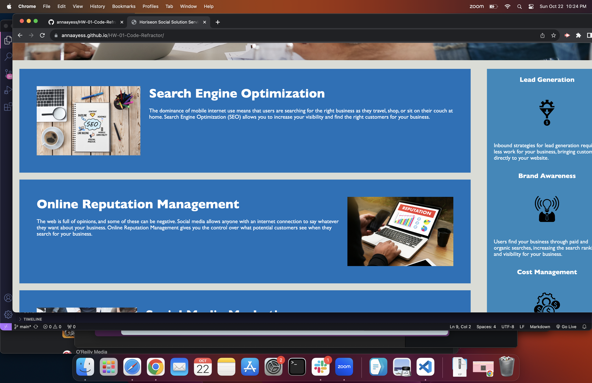

# HW-01-Code-Refractor

## HW Assignment- Code Refractor

The purpose of this project was to make a website more accessible and to clean up the code a bit. I changed a few of the 'div' labels into other HTML elements, like 'section' or 'aside' for example. The Image elements also needed to have 'alt' attributes added so I worked on adding those as well. HTML and CSS codes are included.
 
 ## Visuals
Here is a preview of the deployed website.
 

 ## Support
 For help with this website, please email me at anna.yesaulov@gmail.com

 ##Contributing
 This code originally came from the DU Coding Bootcamp Class File as a Challenge assignment, I did not create it- simply edited a few pieces of it.

 ## License
 [MIT](https://choosealicense.com/licenses/mit/)